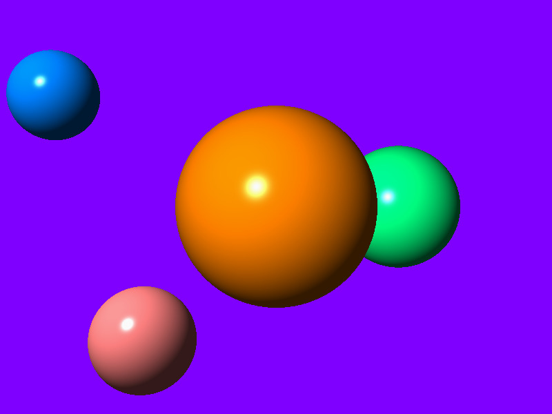
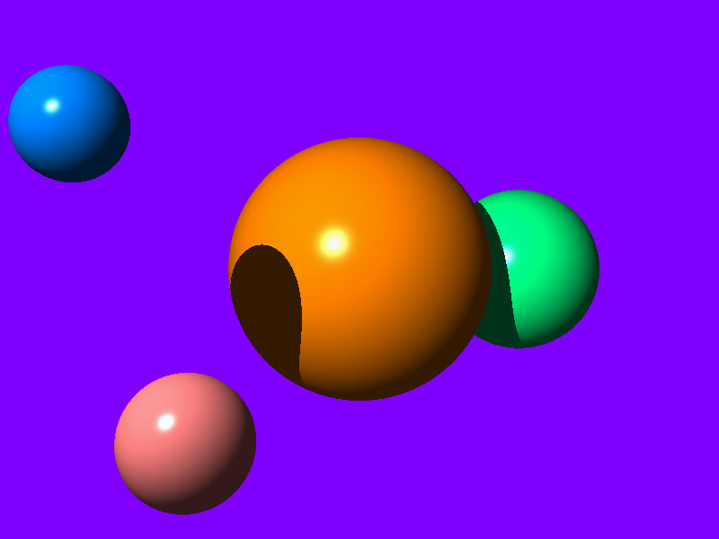
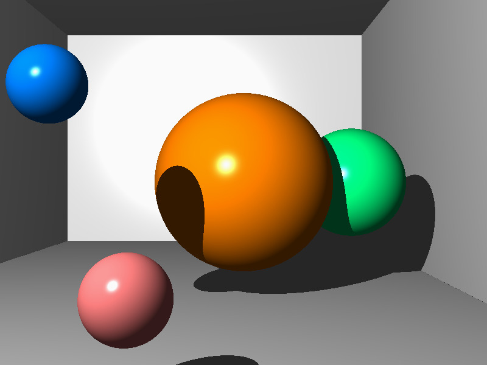
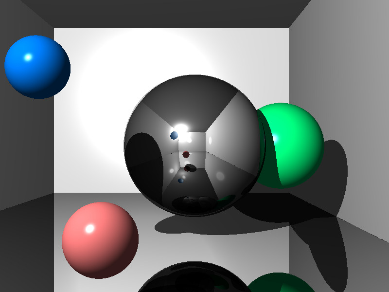

# CS-GY 6533 A / CS-UY 4533 - Interactive Computer Graphics - Fall 2022

# Assignment 2: Ray Tracer by Hao Wu(hw2280@nyu.edu)

### (1) Basic Setup: Camera and View Rays

### (2) Spheres

### (3) Shading

### (4) Shadows

### (5) Planes

### (6) Reflections

## Optional Tasks